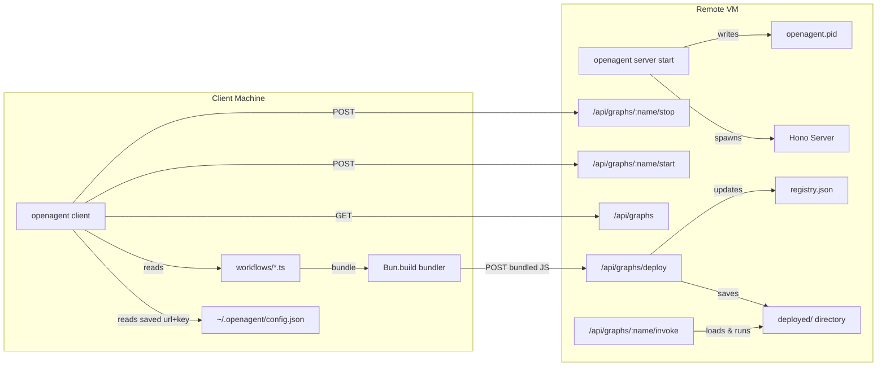

# `openagent` CLI Utility

## Architecture




## Making it a real CLI: `openagent`

- Add `"bin": { "openagent": "./cli.ts" }` to `[package.json](package.json)`
- `[cli.ts](cli.ts)` starts with shebang: `#!/usr/bin/env bun`
- `bun link` installs it globally as `openagent`
- For standalone binary: `bun build --compile cli.ts --outfile openagent`

## CLI Command Structure

### `openagent server` -- run on the VM

- `openagent server start` -- Start the Hono server as a background daemon. Writes PID to `openagent.pid`. Options: `--port 3000`, `--data-dir ./deployed`, `--foreground` (skip daemonize)
- `openagent server stop` -- Stop the running server by sending SIGTERM to the PID in `openagent.pid`
- `openagent server status` -- Check if server is running (read PID file, check process alive), show port, number of deployed graphs, active/inactive counts

### `openagent client` -- run on local machine

- `openagent client connect <url>` -- Save server connection (URL + API key) to `~/.openagent/config.json`. Options: `--key <api-key>`. Subsequent commands use saved config automatically.
- `openagent client graphs` -- List all deployed graphs on the connected server with their status (active/inactive)
- `openagent client start <file-or-name>` -- If given a `.ts` file path: bundle it with `Bun.build`, upload to server, and activate. If given a graph name: activate an already-deployed but inactive graph. Options: `--name <name>` (override graph name when deploying a file)
- `openagent client stop <name>` -- Deactivate a graph (keeps the file on server, just disables the webhook endpoint)

## Server API Endpoints

- `POST /api/graphs/deploy` -- Upload bundled JS code + name, save to `deployed/`, register in registry, activate
- `GET /api/graphs` -- List all graphs with name, status (active/inactive), deployed timestamp
- `GET /api/graphs/:name` -- Get single graph info
- `POST /api/graphs/:name/start` -- Activate a graph (enable webhook)
- `POST /api/graphs/:name/stop` -- Deactivate a graph (disable webhook, keep file)
- `POST /api/graphs/:name/invoke` -- Invoke an active graph with JSON input, return result (the webhook endpoint)
- `DELETE /api/graphs/:name` -- Fully remove a graph (delete file + registry entry)

## Key Design Decisions

- **Bundling on client side**: `Bun.build()` bundles the workflow `.ts` file into a single `.js`, marking npm packages as `external`. Resolves local imports (e.g. `../tools/shell.ts`) so only one file is sent.
- **Dynamic import on server**: Server saves bundled file to `deployed/`, uses `import()` to load it, scans exports for compiled StateGraph instances.
- **Registry with status**: `registry.json` tracks each graph's name, file path, active/inactive status, and deploy timestamp. Only active graphs respond to `/invoke` webhooks.
- **PID-based daemon management**: `server start` spawns itself as a background process and writes PID. `server stop` reads PID and sends SIGTERM. `server status` checks if process is alive.
- **Saved connection config**: `~/.openagent/config.json` stores `{ "url": "...", "key": "..." }` so client commands don't need `--server` and `--key` every time.
- **Auth**: `X-API-Key` header, server reads from env var `API_KEY`.

## File Structure (new files)

- `[cli.ts](cli.ts)` -- CLI entry point with shebang, commander setup, server + client command groups
- `[server/index.ts](server/index.ts)` -- Hono server with all API endpoints
- `[server/registry.ts](server/registry.ts)` -- Graph registry (JSON persistence, status tracking)
- `[server/loader.ts](server/loader.ts)` -- Dynamic graph loader (import + export scanning)

## Implementation Highlights

### Daemonization (`openagent server start`)

```typescript
if (!opts.foreground) {
  const child = Bun.spawn(["bun", import.meta.path, "server", "start", "--foreground", ...args], {
    stdio: ["ignore", "ignore", "ignore"],
    detached: true,
  });
  await Bun.write("openagent.pid", String(child.pid));
  console.log(`Server started (pid: ${child.pid})`);
  process.exit(0);
}
```

### Client-side bundling (`openagent client start <file>`)

```typescript
const result = await Bun.build({
  entrypoints: [filePath],
  target: "bun",
  external: ["@langchain/*", "langchain", "zod"],
});
const bundledCode = await result.outputs[0].text();
await fetch(`${serverUrl}/api/graphs/deploy`, {
  method: "POST",
  headers: { "Content-Type": "application/json", "X-API-Key": apiKey },
  body: JSON.stringify({ name, code: bundledCode }),
});
```

### Saved connection (`openagent client connect`)

```typescript
const configDir = `${process.env.HOME}/.openagent`;
const configPath = `${configDir}/config.json`;
await Bun.write(configPath, JSON.stringify({ url, key }, null, 2));
```

### Dependencies to add

- `hono` -- HTTP framework for the server
- `commander` -- CLI argument parsing with subcommands

